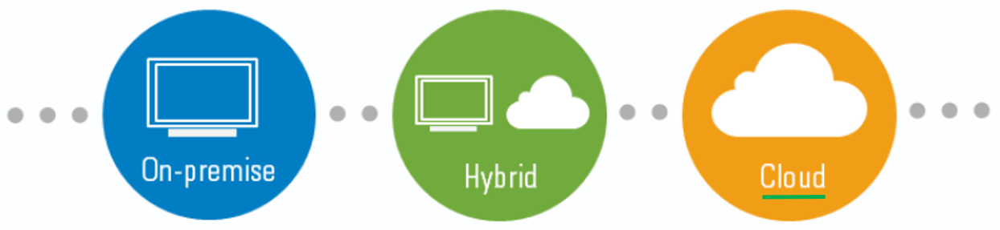

  

# Cloud

This code will be used to practice with the different AWS tools, avoiding as much as possible the use of the console interface, and using the SDK [boto3](https://boto3.amazonaws.com/v1/documentation/api/latest/index.html#) (Python) to obtain the solution architect, machine learning and data analytics certifications.   
 
The IDE used to write the code is Jupyter Notebooks (in local or using Google Colab).

#### >>> The following is the list of points that are planned to be covered. Those that contain the symbol (!) Are those that currently contain information <<<

# 1. Solution Architect

## 1.1. IAM & AWS CLI
- [ ] ☁️ 1.1.1. > [Platform SetUp (!)](Journey/10101/Readme.md)
- [ ] ☁️ 1.1.2. > [Users & Groups (!)](Journey/10102/Readme.md)
- [ ] ☁️ 1.1.3. > [IAM Policy (!)](Journey/10103/Readme.md)

## 1.2. EC2 Fundamentals

## 1.3. EC2 Solutions Architect Associate Level

## 1.4. EC2 Instance Storage

## 1.5. High Availability and Scalability: ELB & ASG

## 1.6. AWS Fundamentals: RDS + Aurora + ElastiCache

## 1.7. Route 53

## 1.8. Classic Solutions Architecture Discussions

## 1.9. Amazon S3 Introduction

## 1.10. AWS SDK, IAM Roles & Policies

## 1.11. Advanced Amazon S3 & Athena

## 1.12. CloudFront & AWS Global Accelerator

## 1.13. AWS Storage Extras

## 1.14. Decoupling applications: SQS, SNS, Kinesis, Active MQ

## 1.15. Containers on AWS: ECS, Fargate, ECR & EKS

## 1.16. Serverless Overviews from a Solution Architect Perspective

## 1.17. Serverless Solution Architecture Discussions

## 1.18. Databases in AWS

## 1.19. AWS Monitoring & Audit: CloudWatch, CloudTrail & Config

## 1.20. Identity and Access Management (IAM) - Advanced

## 1.21. AWS Security & Encryption: KMS, SSM Parameter Store, Cloud HSM, Shield, WAF

## 1.22. Networking - VPC

## 1.23. Disaster Recovery & Migrations

## 1.24. More Solution Architectures

## 1.25. Other Services

# 2. Machine Learning

## 2.1. Data Engenieering

## 2.2. Exploratory Data Analysis

## 2.3. Modeling

## 2.4. ML Implementations & Operations

## 2.5. Wrapping Up

# 3. Data Analytics

## 3.1. Collection

## 3.2. Storage

## 3.3. Processing

## 3.4. Analysis

## 3.5. Visualizationn

## 3.6. Security

## 3.7. Everything else
